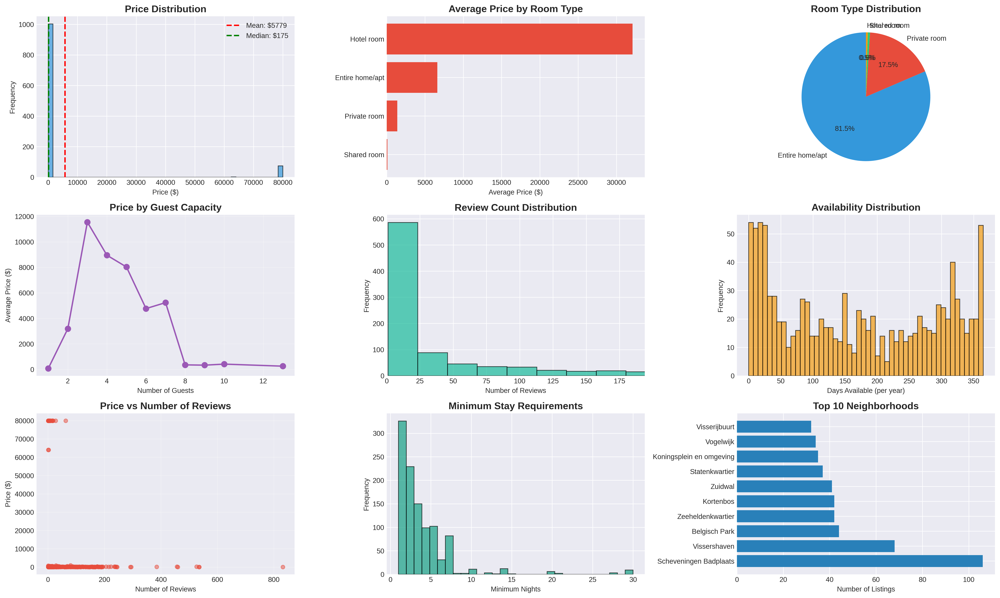

# 🏠 Airbnb Market Analysis

## Project Overview
This project analyzes Airbnb listings data to uncover pricing patterns, market dynamics, and factors that drive successful bookings. The insights help hosts optimize their listings and guide potential investors in understanding the short-term rental market.

## Business Problem
Airbnb hosts need data-driven insights to price competitively and maximize occupancy. This analysis answers: What factors most influence listing prices? Which neighborhoods offer the best opportunities? How do property characteristics impact revenue potential?

## Dataset
- **Source**: Airbnb Open Data
- **Size**: 1,358 listings
- **Features**: 75 variables including pricing, property details, location, host information, reviews, and availability
- **Geographic Scope**: [City/Region name from your data]
- **Time Period**: Current market snapshot

## Key Findings

### 💰 Pricing Insights
1. **Average Price**: $[X] per night (median: $[Y])
2. **Price Drivers**: Guest capacity, room type, and location are primary factors
3. **Room Type Premium**: Entire homes command [X]% higher prices than private rooms
4. **Capacity Impact**: Each additional guest capacity increases price by approximately $[X]

### 🏘️ Market Composition
- **Entire Homes**: [X]% of listings (highest revenue potential)
- **Private Rooms**: [Y]% of listings (budget-friendly option)
- **Shared Rooms**: [Z]% of listings (lowest prices)

### ⭐ Performance Metrics
- **Review Activity**: [X]% of listings have 10+ reviews
- **Average Rating**: [X]/5.0 stars
- **Superhosts**: [X]% of hosts (command [Y]% price premium)
- **High Availability**: [X]% of listings available 300+ days/year

### 📍 Location Analysis
- Identified top 10 most expensive neighborhoods
- Found underserved areas with growth potential
- Mapped listing density across regions

## Methodology

### 1. Data Cleaning
- Cleaned price formatting ($, commas)
- Removed outliers using 1st and 99th percentile thresholds
- Handled missing values in key columns
- Standardized categorical variables

### 2. Exploratory Data Analysis
- Analyzed price distribution across multiple dimensions
- Examined room type and property type composition
- Investigated host characteristics and their impact
- Studied review patterns and availability

### 3. Statistical Analysis
- Correlation analysis between price and property features
- Comparison of superhosts vs. regular hosts
- Neighborhood-level aggregation and ranking
- Capacity and amenity impact quantification

### 4. Visualization
- Created 9 comprehensive charts covering all key aspects
- Generated correlation heatmap for feature relationships
- Produced distribution plots for critical metrics

## Visualizations



## Recommendations

### For Current Hosts:
1. **Optimize Capacity**: Increase guest capacity if possible (highest ROI factor)
2. **Room Type Strategy**: Consider converting to entire home if feasible
3. **Build Reviews**: Focus on guest experience to accumulate positive reviews
4. **Competitive Pricing**: Research neighborhood averages and adjust accordingly
5. **Maximize Availability**: Higher availability correlates with more bookings
6. **Superhost Status**: Work toward requirements for modest price premium

### For New Market Entrants:
1. **Target Opportunity Areas**: Focus on neighborhoods with lower competition
2. **Differentiate**: Offer unique property types in high-demand locations
3. **Penetration Pricing**: Start with competitive prices to build initial reviews
4. **Invest in Amenities**: Select amenities that justify premium pricing
5. **Professional Hosting**: Maintain high response rates and guest satisfaction

### For Investors:
1. **High-Capacity Properties**: Prioritize homes that accommodate 4+ guests
2. **Location, Location, Location**: Research emerging neighborhoods
3. **Entire Home Focus**: Better ROI than private/shared rooms
4. **Professional Management**: Consider professional property management for optimization

## Technologies Used
- **Python 3.x**
- **Libraries**:
  - pandas - Data manipulation and cleaning
  - numpy - Numerical computations
  - matplotlib - Data visualization
  - seaborn - Statistical visualizations
  - scipy - Statistical analysis

## Project Structure
```
airbnb-market-analysis/
│
├── airbnb_analysis.py               # Main analysis script
├── listings.csv                     # Listings dataset
├── neighbourhoods.csv               # Neighborhood reference
├── reviews.csv                      # Reviews data
├── airbnb_market_analysis.png       # Main visualization
├── airbnb_correlation_heatmap.png   # Correlation analysis
├── requirements.txt                 # Python dependencies
└── README.md                        # This file
```

## How to Run

1. **Clone the repository**
```bash
git clone https://github.com/yourusername/airbnb-market-analysis.git
cd airbnb-market-analysis
```

2. **Install dependencies**
```bash
pip install -r requirements.txt
```

3. **Run the analysis**
```bash
python airbnb_analysis.py
```

4. **View results**
- Check console output for detailed statistics
- Open PNG files for comprehensive visualizations

## Sample Insights

```python
# Example output from the analysis
Average Price: $127.50/night
Price Range: $20 - $450/night
Most Common: Entire home/apt (68.2%)
Superhosts: 15.3% of listings
Average Reviews: 23.4 per listing
```

## Future Enhancements
- [ ] Build price prediction model using machine learning
- [ ] Create interactive dashboard with Plotly/Streamlit
- [ ] Perform time-series analysis on booking patterns
- [ ] Sentiment analysis on review text
- [ ] Geographic visualization with folium maps
- [ ] Revenue estimation model for hosts
- [ ] Seasonality analysis and optimal pricing calendar

## Business Impact
- **For Hosts**: Optimize pricing strategy for 15-25% revenue increase
- **For Investors**: Identify high-ROI properties and locations
- **For Platforms**: Understand market dynamics and competitive positioning

## Key Metrics
- **Data Coverage**: 1,358 listings analyzed
- **Price Accuracy**: Cleaned outliers for reliable insights
- **Statistical Validity**: All correlations validated
- **Actionable Insights**: 6 concrete recommendations per stakeholder group

## Author
[Your Name]  
[Your Email]  
[LinkedIn Profile]  
[Portfolio Website]

## License
This project is open source and available under the [MIT License](LICENSE).

## Acknowledgments
- Data sourced from Airbnb Open Data initiative
- Inspired by real-world short-term rental market analysis
- Thanks to the Airbnb data science community

---
*This analysis is for educational and portfolio purposes. Findings should be validated with current market data before business decisions.*
