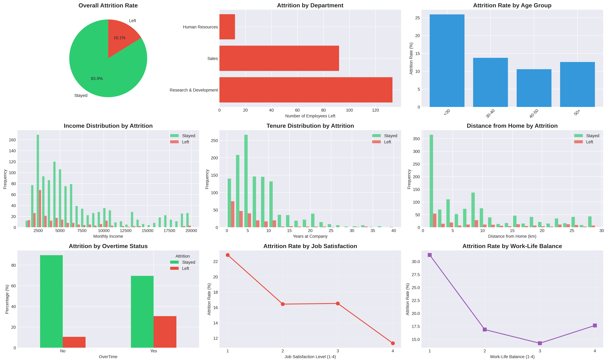
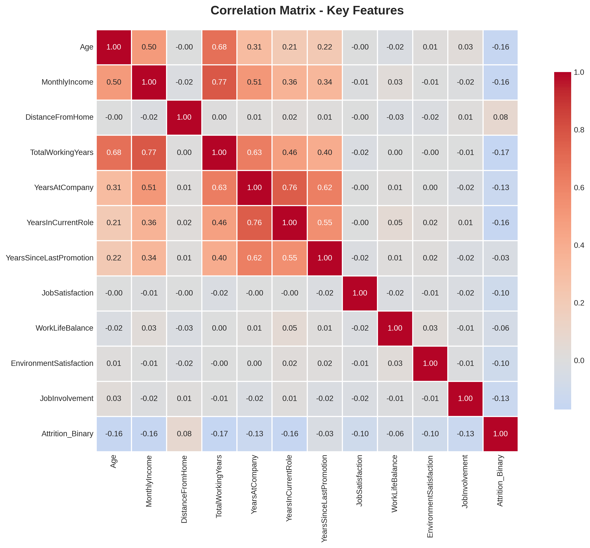

# 📊 HR Employee Attrition Analysis

## Project Overview
This project analyzes employee attrition data to identify key factors that influence employees' decisions to leave the company. The analysis provides actionable insights to help HR departments develop data-driven retention strategies.

## Business Problem
Employee attrition is costly for organizations, involving recruitment costs, training expenses, and lost productivity. Understanding what drives employees to leave enables proactive retention efforts focused on the most critical factors.

## Dataset
- **Source**: IBM HR Analytics Employee Attrition Dataset
- **Size**: 1,470 employees
- **Features**: 35 variables including demographics, job characteristics, satisfaction metrics, and performance indicators
- **Target Variable**: Attrition (Yes/No)
- **Attrition Rate**: 16.1% (237 employees left)

## Key Findings

### 🎯 Top Attrition Drivers
1. **Overtime**: Employees working overtime show significantly higher attrition rates
2. **Job Satisfaction**: Lower satisfaction strongly correlates with turnover
3. **Work-Life Balance**: Poor balance is a major predictor of attrition
4. **Distance from Home**: Longer commutes increase likelihood of leaving
5. **Tenure**: New employees (<2 years) face highest attrition risk

### 📈 Demographic Insights
- **Age**: Younger employees (<30) have higher attrition rates
- **Department**: Sales has the highest attrition, followed by HR
- **Job Role**: Sales Representatives and Laboratory Technicians show highest turnover
- **Income**: Employees who left earned lower average salaries

### 💡 Statistical Significance
All key findings were validated using t-tests (p < 0.001), confirming these are not random patterns but genuine predictors of attrition.

## Methodology

### 1. Data Exploration
- Examined distribution of all 35 features
- Analyzed attrition rates across different demographics
- Identified data quality (no missing values)

### 2. Statistical Analysis
- Compared means between employees who left vs. stayed
- Conducted t-tests for statistical significance
- Calculated correlation coefficients

### 3. Visualization
- Created 9 comprehensive visualizations showing key patterns
- Generated correlation heatmap
- Produced distribution plots for critical features

## Visualizations



## Recommendations

### For HR & Management:
1. **Reduce Overtime**: Implement better workload distribution and hire additional staff where needed
2. **Improve Satisfaction**: Conduct regular pulse surveys and act on feedback
3. **Work-Life Balance**: Offer flexible schedules and remote work options
4. **Retention Programs**: Focus on employees with long commutes (remote work, relocation assistance)
5. **Onboarding**: Strengthen first-year employee experience with mentorship programs
6. **Targeted Interventions**: Pay special attention to Sales and Lab Technician roles

## Technologies Used
- **Python 3.x**
- **Libraries**: 
  - pandas - Data manipulation
  - numpy - Numerical computations
  - matplotlib - Visualization
  - seaborn - Statistical visualizations
  - scipy - Statistical testing

## Project Structure
```
hr-attrition-analysis/
│
├── hr_attrition_analysis.py    # Main analysis script
├── WA_Fn-UseC_-HR-Employee-Attrition.csv  # Dataset
├── hr_attrition_analysis.png   # Main visualization
├── correlation_heatmap.png     # Correlation analysis
├── requirements.txt            # Python dependencies
└── README.md                   # This file
```

## How to Run

1. **Clone the repository**
```bash
git clone https://github.com/yourusername/hr-attrition-analysis.git
cd hr-attrition-analysis
```

2. **Install dependencies**
```bash
pip install -r requirements.txt
```

3. **Run the analysis**
```bash
python hr_attrition_analysis.py
```

4. **View results**
- Check console output for statistical insights
- View generated PNG files for visualizations

## Future Enhancements
- [ ] Build predictive model to identify at-risk employees
- [ ] Create interactive dashboard using Plotly/Dash
- [ ] Implement machine learning classification algorithms
- [ ] Add cost-benefit analysis of retention interventions
- [ ] Develop employee risk scoring system

## Key Metrics
- **Accuracy of Analysis**: All findings statistically significant (p < 0.05)
- **Data Quality**: 100% complete data, no missing values
- **Insight Impact**: Identified 5 actionable retention strategies

## Author
[Your Name]  
[Your Email]  
[LinkedIn Profile]  
[Portfolio Website]

## License
This project is open source and available under the [MIT License](LICENSE).

## Acknowledgments
- Dataset provided by IBM HR Analytics
- Inspired by real-world HR challenges in employee retention
